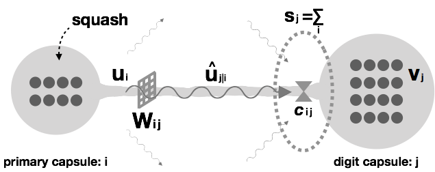
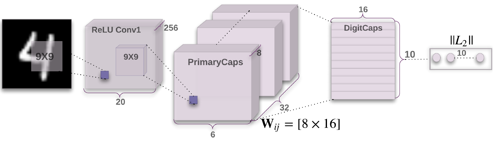

%Capsule Network MNIST 구현과 실험

<!--
`readme2tex`를 사용해서 github README.md에 LaTeX 수식을 포함하는 방식을 사용하고 있다.
그러려면 README.md를 직접 수정하지 말고 READOTHER.md를 수정한 후에 다음 명령어로 README.md를 갱신해주어야 한다.
python -m readme2tex --output README.md READOTHER.md
-->

## 요약

[Dynamic Routing between Capsules](CapsNet.pdf)(논문)에 나오는 MNIST Capsule Network의 TensorFlow 구현입니다.
논문 자체와 그것을 구현한 [naturomics/CapsNet-Tensorflow](https://github.com/naturomics/CapsNet-Tensorflow)를 이해하려고 따라서 구현했습니다.

그 과정에서 궁금한 부분을 다른 방식으로 구현하고 비교했습니다.

## 설치하기

의존성:

* Python 3.6.1
* tqdm 4.15.0
* numpy 1.13.1
* tensorflow 1.4.1

설치:

``` shell
git clone https://github.com/veshboo/capsnet-tf

```

## 사용법

CPU만으로 실행이 가능하지만 너무 느립니다.

GPU 메모리가 부족한 경우에는 `--batch_size`에 작은 값을 지정하면 메모리를 적게 사용합니다.
기본값은 128입니다.

* 훈련
``` shell
python main.py --save_freq=1 --batch_size=16 --epoch=5
```

`--save_freq`에 지정한 epoch 회수 단위로 checkpoint합니다.
최근 checkpoint부터 이어서 훈련하므로 여기에 작은 값을 지정하여, 작은 epoch를 누적하는 방식으로 훈련할 수 있습니다.

* 훈련 과정 모니터링, 결과 확인

``` shell
tensorboard --logdir logdir
cat results/loss.csv
cat results/train_acc.csv
cat results/val_acc.csv
```

* 정확도 테스트

``` shell
python main.py --batch_size=16 --is_training=False
cat results/test_acc.csv
```

## 궁금했던 점

논문의 Equation 2의 뒷 부분의 식 ()을 이용해서 primary capusule에서 digit capsule로의 "예측 벡터들 (prediction vectors)"을 계산할 때 "primary capsule 레이어에는 32개의 채널이 있고, 같은 채널에 속한 primary capsule 36개 ()는 가중치 (weights)를 공유한다"고 되어 있는데 (원문)

> In total PrimaryCapsules has [] capsule outputs (each output is an 8D vector)
> and **each capsule in the [6 \times 6] grid is sharing their weights with each other**.

참고한 naturomics의 구현에서는 를 공유하지 않고 `tf.tile`로 36번 복사하는 방식으로 구현하고 있어서, 그 대신에 `tf.scan`을 이용해 를 공유하여 반복 계산하는 방식으로 구현하고 비교했습니다.

마찬가지로 batch_size에 대해서도 를 `tf.tile`로 복사하는 방식으로 구현되어 있습니다.
이 부분도 `tf.scan`을 사용해 구현하고 예측 정확도, 훈련 시간에 어떤 영향이 있는지 확인했습니다.
GPU 메모리 사용량에 대해서도 궁금하지만 관련 지식이 부족해서 확인하지 않았습니다.

## 결과

테스트 환경

* macOS High Sierra
* CPU 3.4 GHz i7
* GeForce GTX 680MX 2GB

다음과 같이 3회 실행한 값입니다.

``` shell
python main.py --save-freq=1 --batch-size=16 --epoch=20  # 훈련 (GPU 2시간 이상)
python main.py --is_training=False                       # 예측 정확성 테스트
cat results/test_acc.csv                                 # 결과 출력
```

| 구현 | test accuracy (%) | 훈련 소요 시간 |
|:----------------------------|:-----------:|:-----------:|
| 원래 구현 (naturomics) | <!--[0.9934, 0.9935, 0.9945]--> 0.62  0.050 | 3h 41m 58s |
| 동일 채널의 36개 primary capsule들이<br/>하나의 를 공유하는 구현 | <!--[0.9915, 0.9884, 0.9909]--> 0.97  0.134 | 3h 33m 49s |
| batch_size에 대해서(만) `tf.scan`을 사용한 구현 | <!--[0.9931, 0.9940, 0.9938]--> 0.64  0.039 | 3h 40m 44s |

결과를 해석하면 `tf.tile`을 사용한 원래 구현이 그 만큼 많은 파라미터를 사용하므로 더 예측을 잘하는 것으로 보입니다.
마침 논문에 기술된 내용을 어떻게 해석할 것인가에 대해 이슈가 올라와 있으니 참고하기 바랍니다.
([questions about the weight maxtrix Wij between ui and vj](https://github.com/naturomics/CapsNet-Tensorflow/issues/9))

요약하면, feature map을 구성하는 기본단위 (기존 CNN에서는 픽셀/뉴런 1개, CapsNet에서는 캡슐 1개) 별로 weight을 적용하는 Convolutional Neural Network의 fully connected 레이어의 기본을 떠올리면 한 채널에 있는 36개의 캡슐들이 weights를 공유하는 것이 아니라 **한 캡슐의 8개의 벡터들이 weight을 공유**하는 것으로 해석하는 것이 맞는 것 같습니다.
(글로 읽어서는 공감을 못했는데 막상 결과 수치를 보니 공감이 됩니다.)

다음으로, batch_size만큼 weight를 `tf.tile`하는 것은 메모리를 더 사용하여 빨리 훈련시키기 위한 것으로 예상했으나 실제로는 `tf.scan`으로 반복하게끔 구현한 것이 오히려 아주 조금 빨랐습니다.
GPU 메모리 크기나 batch_size에 따라 다양한 테스트를 해야 해석이 가능할 것 같습니다.
예측 정확도는 비슷한 수준입니다.

-----

이 뒤로는 구현에 대한 상세 설명입니다.
tensor 조작에 익숙하지 않아 정리를 겸했습니다.

## **예측 벡터** 계산



primary 캡슐 의 출력에서 digit 캡슐 로의 예측 벡터를 계산하는 모형이다.
그림에 등장하는 tensor들의 shape은 다음과 같다.

| tensor                |  shape  | 비고 |
|:---------------------:|:--------|:----|
|            | (8, 1)  | primary capsule 벡터 |
|            | (16, 1) | digit capsule 벡터 |
|          | (16, 1) | squash 함수는 tensor의 shape을 바꾸지 않음 |
|  | (16, 1) | 커플링 계수  이용한 weighted sum도 마찬가지 |
|               | ()      | scalar |
|         | (8, 16) | (8, 1)을 (16, 1)로 변환하기 위한 가중치 행렬 |

## CapsNet for MNIST

<br/>(논문에 나온 그림)

MNIST Capsule Network에는 primary capsule이 1152 = 32 x 6 x 6개 digit capsule이 10개 있다.

## naturomics의 구현

와 의 `tf.matmul`을 위해 shape을 맞추고 batch_size (bs)까지 고려하면, 결과적으로 사용되는 tensor들의 shape은 다음과 같다.

|tensor|shape|비고|
|:-:|:-------:|:--------------|
|  | (bs, 1152, 10, 8, 1) | primaryCaps 레이어의 캡슐 1152개, 와의 `tf.matmul`위한 `tf.reshape`과 `tf.tile` 처리 |
|  | (bs, 1, 10, 16, 1)          | digitCaps 레이어의 캡슐 10개 |
|  | (bs, 1, 10, 16, 1)          | squash 함수는 shape을 바꾸지 않음 |
|  | (bs, 1152, 10, 16, 1) | 밑 2차원은 벡터, nested-for-bs-i-j |
|        | (bs, 1152, 10, 1, 1)        | 밑 2차원은 scalar, nested-for-bs-i-j |
|  | (bs, 1152, 10, 8, 16)       | 밑 2차원은 행렬, nested-for-bs-i-j |

nested-for-bs-i-j
: `for bs: for i: for j:`에 해당하는 vectorization (적합한 표현인가?)

scalar
: scalar를 (1, 1)로 shape하는 이유는 element-wise 계산에 사용되기 때문

## 동일 채널의 36개 primary capsule들이 하나의 를 공유하는 구현

naturomics의 원래 구현에서 고쳐 볼 부분은 의 두번째 차원 1152=32x(6x6)에서 6x6회를 `tf.scan`을 사용해 반복 처리하는 것이다.
이를 위해 먼저 (bs, 32, 36, 10, 8, 1) 형태로 `tf.reshape`하고 `tf.transpose`를 이용해 36을 맨 위 차원으로 빼낸다.
그리고는 `tf.scan`에 `lambda`로 전달하는 `tf.matmul`을 위해 `tf.tile` 10으로 상위 차원의 shape을 맞춘다.

``` python
# Shape u for tf.matmul(W, u) in tf.scan, tranpose to send the 36 outer
# reshape:   [bs, 1152, 1, 8, 1]   => [bs, 32, 36, 1, 8, 1]
#                 ^^^^                     ^^  ^^
# transpose: [bs, 32, 36, 1, 8, 1] => [36, bs, 32, 1, 8, 1]
#             ^^^^^^^ ^^               ^^  ^^^^^^
# tile:      [36, bs, 32, 1, 8, 1] => [36, bs, 32, 10, 8, 1]
#                         ^                        ^^
u = tf.reshape(u, [cfg.batch_size, 32, -1, 1, 8, 1])
u = tf.transpose(u, perm=[2, 0, 1, 3, 4, 5])
u = tf.tile(u, [1, 1, 1, 10, 1, 1])
```

`tf.scan`을 이용해서 와 를 `tf.matmul`하는 코드는 다음과 같다.

``` python
# W: [bs, 32, 10, 8, 16], will be repeated 36 times by tf.scan
W = tf.get_variable('Weight', shape=[1, 32, 10, 8, 16], dtype=tf.float32,
                    initializer=tf.random_normal_initializer(stddev=cfg.stddev))
W = tf.tile(W, [cfg.batch_size, 1, 1, 1, 1])

# Eq.2, uh
# [bs, 32, 10, 8, 16].T x [36, bs, 32, 10, 8, 1] => [36, bs, 32, 10, 16, 1]
uh = tf.scan(lambda ac, x: tf.matmul(W, x, transpose_a=True), u,
             initializer=tf.zeros([cfg.batch_size, 32, 10, 16, 1]))
```

계산된 를 사용하는 뒤따르는 단계에 적합하도록 텐서의 모양을 변경해서 반환한다.

``` python
# Transpose and reshape uh back for sum_I {c (*) uh}
# transpose: [36, bs, 32, 10, 16, 1] => [bs, 32, 36, 10, 16, 1]
#             ^^  ^^^^^^                 ^^^^^^  ^^
# reshape:   [bs, 32, 36, 10, 16, 1] => [bs, 1152, 10, 16, 1]
#                 ^^^^^^                     ^^^^
uh = tf.transpose(uh, perm=[1, 2, 0, 3, 4, 5])
uh = tf.reshape(uh, shape=[cfg.batch_size, -1, 10, 16, 1])
return uh
```

[결과](#결과)에서 말했듯이 논문이 의도한 구현이 아니다.

## batch_size에 대해서 tf.scan을 사용한 구현

좀 더 간단하다.
는 naturomics와 동일하다.
는 batch_size 만큼 `tf.tile`하는 대신에 `tf.scan`으로 반복하게끔 한다.

``` python
# Shape u for tf.matmul(W, u) in tf.scan
# reshape: [bs, 1152, 8, 1]    => [bs, 1152, 1, 8, 1]
#               ^^^^                   ^^^^^^^
# tile:    [bs, 1152, 1, 8, 1] => [bs, 1152, 10, 8, 1]
#                     ^                      ^^
u = tf.reshape(u, [cfg.batch_size, -1, 1, 8, 1])
u = tf.tile(u, [1, 1, 10, 1, 1])

# W: [1152, 10, 8, 16], will be repeated batch_size times by tf.scan
W = tf.get_variable('Weight', shape=[1152, 10, 8, 16], dtype=tf.float32,
                    initializer=tf.random_normal_initializer(stddev=cfg.stddev))

# Eq.2, u_h
# [1152, 10, 8, 16].T x [bs, 1152, 10, 8, 1] => [bs, 1152, 10, 16, 1]
uh = tf.scan(lambda ac, x: tf.matmul(W, x, transpose_a=True), u,
             initializer=tf.zeros([1152, 10, 16, 1]))
assert uh.get_shape() == [cfg.batch_size, 1152, 10, 16, 1]
return uh
```
